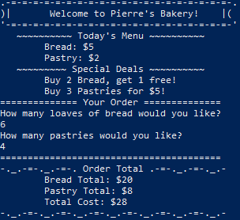

# _[C-sharp Bakery](https://github.com/TSiu88/csharp-bakery.git)_

#### _Week 8 Independent Friday Assignment for [Epicodus](https://www.epicodus.com/), 02.28.2020_

#### By _**Tiffany Siu**_

## Description

This application is the Week 8 Friday independent assignment for Epicodus' full time Intro to Programming and C#/React course.  This is a program made to show basic C# concepts, syntax, and structure with a focus on classes, namespaces, methods, and properties.  This also focuses on concepts learned this week of visibility, access modifiers, encapsulation, and abstraction.

This program is a console application for a bakery that allows a user to order different bakery items and receive the total cost of what was ordered.  The items of bread and pastries have individual costs (bread for $5 and pastries for $2) but also have special deals which have a discounted price.  The special deals are "Buy 2 get 1 free" for bread and "3 for $5" for pastries.

## Setup/Installation Requirements

### Requirements to Run
* _.NET_
* _Command Prompt_

### Instructions

*This page may be viewed by:*

1. Download and install .NET Core from the [official website](https://dotnet.microsoft.com/download/dotnet-core/)
2. Clone the [repository](https://github.com/TSiu88/csharp-bakery.git) from my [GitHub page](https://github.com/TSiu88)
3. Use a `command line interface` to move to the repository's directory with `cd project-directory`
4. Run `dotnet run` to start up the program in the command line interface 

## Other Technologies Used

* _C#_
* _Markdown_

## Notable Features
This program uses several ASCII borders to make different sections of the text stand out in the console.  The special special deals in the menu are created with different wording depending on the number of items and the price for a special deal instead of being hardcoded in.

## Specifications

| Specification | Input | Output |
| :-------------     | :------------- | :------------- |
| **The program displays welcome message and menu with prices** | Application start | "Welcome to Pierre's Bakery!" Bread=$5, Pastries=$2 |
| **The program displays special deals in readable format** | Application start | Special deals displayed ("Buy 2, get 1 free" "3 for $5") |
| **If the program takes input of user that is not an integer, assume quantity 0 ordered** | Bread="aaa", Pastry="" | Bread=0, Pastry=0 |
| **The program takes number of loaves of bread and pastries and displays totals** | Bread=4, Pastry=4 | Bread=$20, Pastry=$8, Total=$28 |
| **If input qualifies for special deals, costs calculated using discounted price** | Bread=3, Pastry=3 | Bread=$10, Pastry=$5, Total=$15 |
| **The program can be exited with input "quit" whenever input is prompted** | Input="quit" | "Goodbye!" Application exits |

## Screenshots

_Here is a snippet of what the console looks like:_

## Known Bugs

_There are currently no known bugs in this program_

## Support and contact details

_If there are any question or concerns please contact me at my [email](mailto:tsiu88@gmail.com). Thank you._

### License

*This software is licensed under the MIT license*

Copyright (c) 2020 **_Tiffany Siu_**
